# Gossip MCP: implementation, security and efficiency

For detailed subsystem mechanics, HTTP routes, CLI commands, prompts and the production function index, see [the implementation companion](implementation-mechanics.md). This is a source analysis of the legacy JSON MCP package, not a supported MCP contract, protocol specification or security certification. The legacy CLI transport and schema exporter are retired because they have no project membership boundary. Use `coord-mcp` and its project credential for current MCP access. The historical operation inventory was generated from old registrations in `pkg/mcp/server.go`; aliases shared their handler. Descriptions and generated JSON under `mcp/` may be stale and must not be used to configure a current agent. The diagrams list statically visible handler calls in source order; conditional calls may be skipped and repeated calls may occur in loops. They are a map for tracing, not a claim that each call always succeeds.

## Architecture and lifecycle

`cmd/gossip/main.go` opens a store, creates the roles provider and MCP server, and serves JSON-RPC over stdio using `mcp-go`. The server constructs managers for messages, tasks, graph, deliberation, SOP, guardrails, events, MoE and vault. Each tool parses arguments, calls one or more managers and returns text, JSON encoded as text, or a tool error. Stdio access inherits the operating system privileges of the process; no independent MCP caller authentication is implemented in these handlers.

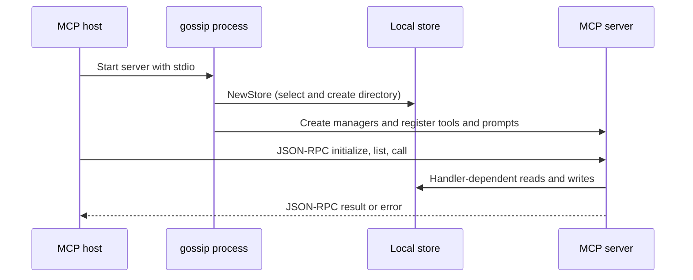
```mermaid
sequenceDiagram
    participant Host as MCP host
    participant CLI as gossip process
    participant Store as Local store
    participant MCP as MCP server
    Host->>CLI: Start server with stdio
    CLI->>Store: NewStore (select and create directory)
    CLI->>MCP: Create managers and register tools and prompts
    Host->>MCP: JSON-RPC initialize, list, call
    MCP->>Store: Handler-dependent reads and writes
    MCP-->>Host: JSON-RPC result or error
```

Store selection is explicit directory, `GOSSIP_DIR`, nearest ancestor `.local/gossip`, then current directory `.local/gossip`. The store creates directories with mode 0755; its atomic writes use a same-directory temporary file, mode 0644, then rename. These modes are subject to umask and do not make general state private. The store lock combines a process mutex with an advisory file lock; POSIX acquisition retries for up to 10 seconds. This coordinates cooperating users of the lock, not arbitrary writers; atomic rename is per file, not a transaction across managers. See `pkg/state/state.go` and `pkg/state/lock_posix.go`.

## Security properties and limitations

* Agent IDs, roles and message senders are caller-provided data, not authenticated principals. Goal and custom-role authorization is conditional on a supplied caller role; `AuthorizeAction` also accepts an empty role. The debate conclusion handler does not call that authorization helper. Do not treat role labels as access control (`pkg/mcp/server.go`, `pkg/security/security.go`).
* Guardrail validation is an explicit tool; other tools are not globally intercepted by it. SOP gates and recorded reviews are workflow controls, not isolation against a client that can call other tools or write the files directly.
* Store reads and atomic writes call `ValidateSafePath`, resolving existing symlinks and checking containment. This is a path check, not a race-free filesystem capability: filesystem changes between check and use remain relevant. Individual subsystems can use other filesystem APIs; do not assume this check covers every path. Payload limits are applied to selected fields and handlers, not globally.
* The legacy web server binds to `127.0.0.1` and uses plain HTTP. Basic authentication applies only when both credentials have been configured; `SetAuth` disables it otherwise. Its legacy FRP activation and HTTP config-generation paths are disabled because they lack the project-scoped mTLS boundary. The separate coordination UI defaults to loopback and requires HTTPS mutual TLS, an enrolled client-certificate project grant, and a project credential for non-loopback access. See `pkg/web/server.go` and `pkg/coord/web.go`.
* Vault staging stores plaintext on disk with requested mode 0600, and returns metadata including paths and SHA-256. Remote transfer uses AES-256-GCM with random salt and nonce and PBKDF2-HMAC-SHA256 at 10,000 iterations. The passphrase is included in the HTTP JSON request, so HTTP exposes both the passphrase and ciphertext; use a protected transport. The HTTP transfer code does not set Basic Auth, while an authenticated web server requires it. A non-HTTP endpoint can return a completed receipt without a network transfer; HTTP success is accepted without verifying a receiver receipt. Existing file permissions and vault index write errors also deserve attention. See `pkg/vault/vault.go`.
* Remote query accepts HTTP and HTTPS endpoints, uses optional Basic Auth and a 15-second timeout. Credentials are also included in the request structure sent as JSON. Endpoint selection can cause outbound requests to caller-selected hosts; restrict who can invoke it and protect transport. The remote graph query uses depth 2 irrespective of the request depth (`pkg/tunnel/federation.go`).
* Some composite handlers deliberately discard errors, such as introduction broadcast and portions of reidentification; a successful briefing does not prove every side effect succeeded. Likewise, debate conclusion ignores failure to insert the optional decision graph node.

## Efficiency and consistency

Most managers persist JSON documents and load or rewrite whole containers; cost therefore grows with the relevant file size, and lock contention increases with concurrent writers. Messages and events involve scans; repeated polling magnifies I/O. `events.Poll` gathers immediately and then every 300 ms until updates, cancellation, or its timeout capped at 60 seconds; many idle long polls can repeatedly scan the same state. Graph indexing traverses the repository and graph analysis depends on graph size and algorithm parameters; use narrower roots and bounded queries when possible. Vault transfer reads the entire file, encrypts it in memory, hex-encodes it and serializes JSON, increasing memory and wire size. Remote calls have network latency and explicit timeouts. These are source-level observations, not benchmark results; no latency or scalability measurements are implied.

MoE dispatch creates and returns tracks/work packages in local state; it does not itself start external model processes. Cron setup/check should be read as the code implements it, rather than assuming a continuously running scheduler. The graph is a local structured knowledge graph; do not infer vector embedding or semantic search from the RAG tool names.

## Operation sequences

Each diagram covers one registered operation. An alias is listed alongside its shared canonical handler. The handler-call arrows report directly visible calls in source order, including conditional or error-handling paths; internal manager locking, persistence and secondary calls are not expanded. Input schemas and defaults are in the linked registration. The diagrams deliberately do not imply that every operation writes to disk.

### `gossip_register_agent`

Register an agent session in the gossip mesh with its designated role and capabilities.

[Registration and handler](../pkg/mcp/server.go#L237).

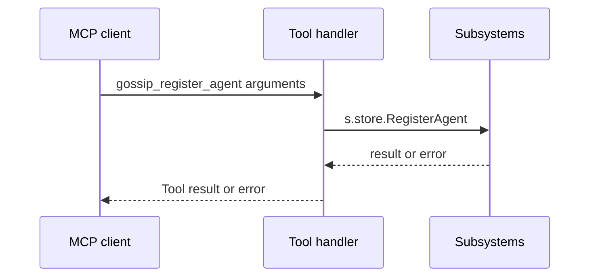
```mermaid
sequenceDiagram
    participant C as MCP client
    participant H as Tool handler
    participant S as Subsystems
    C->>H: gossip_register_agent arguments
    H->>S: s.store.RegisterAgent
    S-->>H: result or error
    H-->>C: Tool result or error
```

### `gossip_list_agents`

List all registered agents, their current status, roles, tasks, last heartbeats, and mandatory remote tunnel/agent disclosure.

[Registration and handler](../pkg/mcp/server.go#L276).

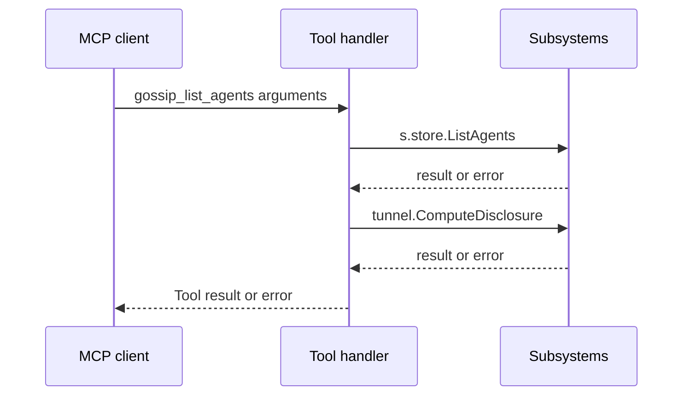
```mermaid
sequenceDiagram
    participant C as MCP client
    participant H as Tool handler
    participant S as Subsystems
    C->>H: gossip_list_agents arguments
    H->>S: s.store.ListAgents
    S-->>H: result or error
    H->>S: tunnel.ComputeDisclosure
    S-->>H: result or error
    H-->>C: Tool result or error
```

### `gossip_heartbeat`

Send a heartbeat to keep agent session active and update current task or status.

[Registration and handler](../pkg/mcp/server.go#L292).

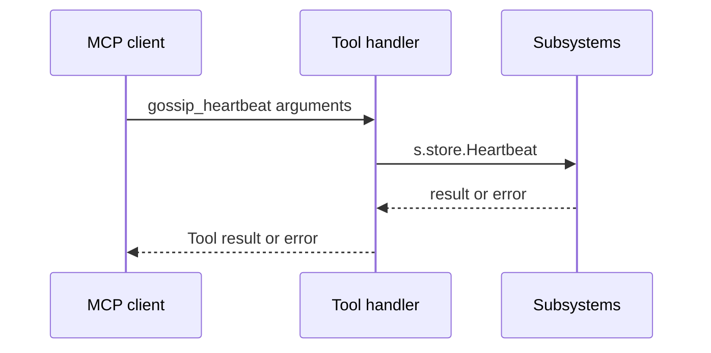
```mermaid
sequenceDiagram
    participant C as MCP client
    participant H as Tool handler
    participant S as Subsystems
    C->>H: gossip_heartbeat arguments
    H->>S: s.store.Heartbeat
    S-->>H: result or error
    H-->>C: Tool result or error
```

### `gossip_reidentify_agent`

Aliases: `gsp_reidentify`, `gossip_resume_session`.

Re-identify or resume an agent session across restarts or new context sessions, returning an instant catch-up briefing of assigned tasks, unread inbox messages, active SOP stages, and personal to-dos.

[Registration and handler](../pkg/mcp/server.go#L315).

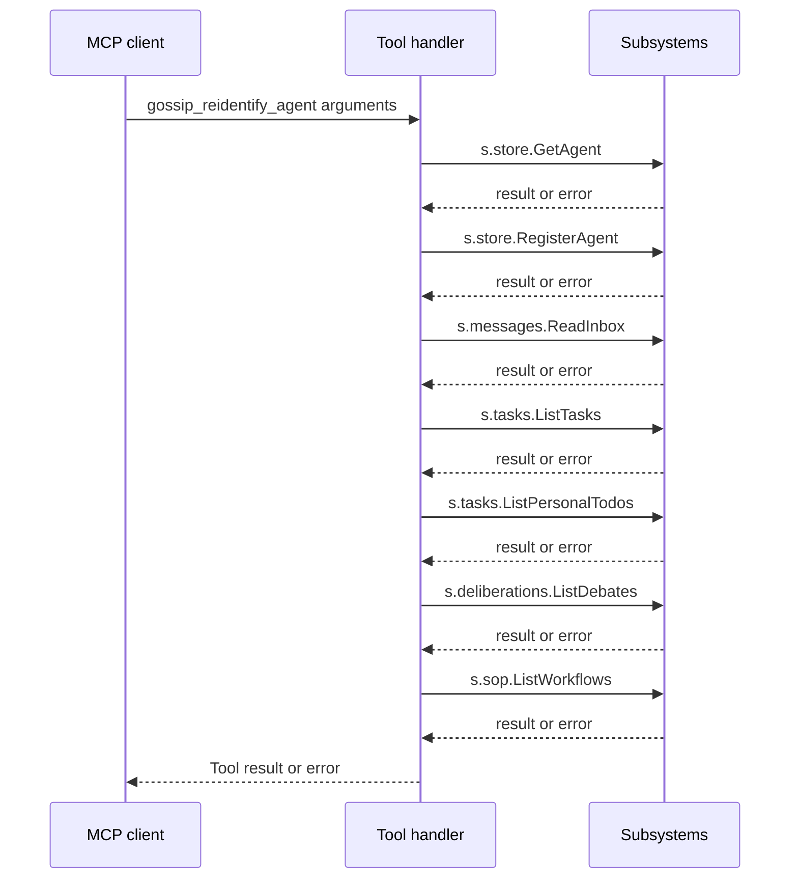
```mermaid
sequenceDiagram
    participant C as MCP client
    participant H as Tool handler
    participant S as Subsystems
    C->>H: gossip_reidentify_agent arguments
    H->>S: s.store.GetAgent
    S-->>H: result or error
    H->>S: s.store.RegisterAgent
    S-->>H: result or error
    H->>S: s.messages.ReadInbox
    S-->>H: result or error
    H->>S: s.tasks.ListTasks
    S-->>H: result or error
    H->>S: s.tasks.ListPersonalTodos
    S-->>H: result or error
    H->>S: s.deliberations.ListDebates
    S-->>H: result or error
    H->>S: s.sop.ListWorkflows
    S-->>H: result or error
    H-->>C: Tool result or error
```

### `gossip_introduce_agent`

Aliases: `gossip_introduce`, `gsp_introduce`.

Introduce an agent to the Gossip mesh: registers session, broadcasts an announcement to all peers, and returns an instant onboarding briefing (goals, pending tasks, active SOP gates, caution rules, and disclosed peers).

[Registration and handler](../pkg/mcp/server.go#L464).

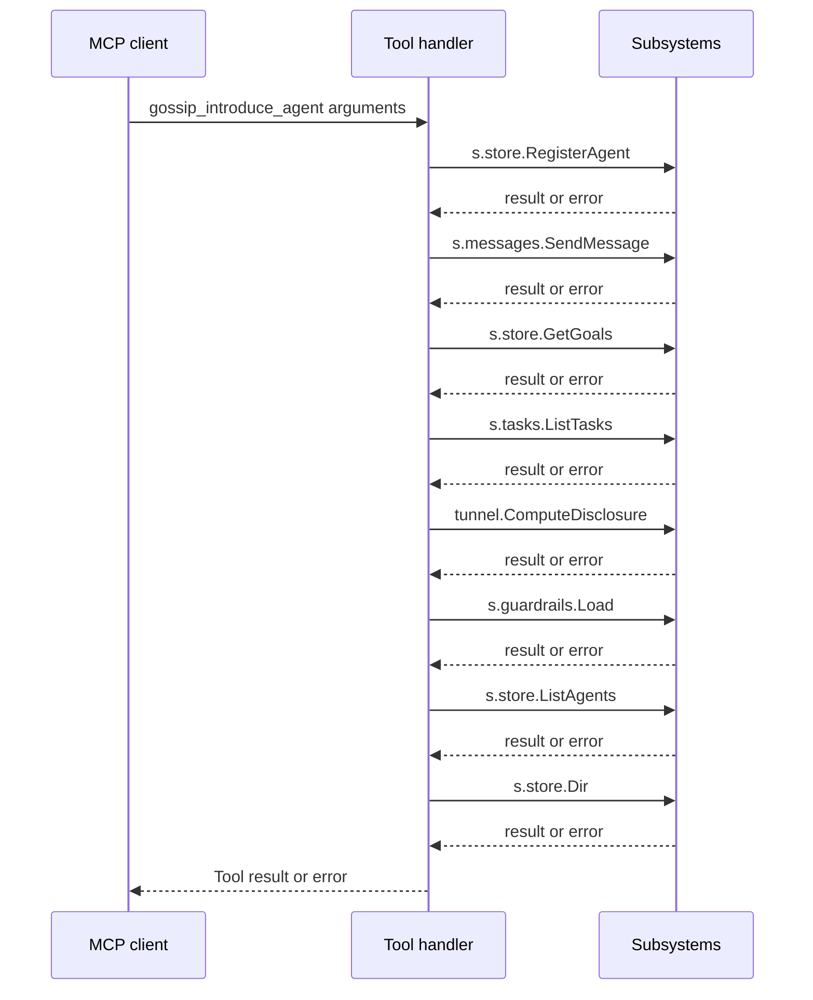
```mermaid
sequenceDiagram
    participant C as MCP client
    participant H as Tool handler
    participant S as Subsystems
    C->>H: gossip_introduce_agent arguments
    H->>S: s.store.RegisterAgent
    S-->>H: result or error
    H->>S: s.messages.SendMessage
    S-->>H: result or error
    H->>S: s.store.GetGoals
    S-->>H: result or error
    H->>S: s.tasks.ListTasks
    S-->>H: result or error
    H->>S: tunnel.ComputeDisclosure
    S-->>H: result or error
    H->>S: s.guardrails.Load
    S-->>H: result or error
    H->>S: s.store.ListAgents
    S-->>H: result or error
    H->>S: s.store.Dir
    S-->>H: result or error
    H-->>C: Tool result or error
```

### `gossip_setup`

Aliases: `gossip_setup_mesh`, `gsp_setup`.

Bootstrap the legacy local Gossip store in the current workspace: initializes state, goals, task DAG, knowledge graph, guardrails, and optional cron checking. Its old HTTP FRP setup option is rejected before changing state.

[Registration and handler](../pkg/mcp/server.go#L591).

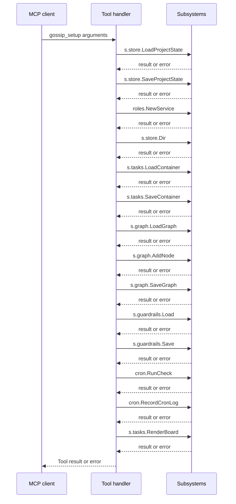
```mermaid
sequenceDiagram
    participant C as MCP client
    participant H as Tool handler
    participant S as Subsystems
    C->>H: gossip_setup arguments
    H->>S: s.store.LoadProjectState
    S-->>H: result or error
    H->>S: s.store.SaveProjectState
    S-->>H: result or error
    H->>S: roles.NewService
    S-->>H: result or error
    H->>S: s.store.Dir
    S-->>H: result or error
    H->>S: s.tasks.LoadContainer
    S-->>H: result or error
    H->>S: s.tasks.SaveContainer
    S-->>H: result or error
    H->>S: s.graph.LoadGraph
    S-->>H: result or error
    H->>S: s.graph.AddNode
    S-->>H: result or error
    H->>S: s.graph.SaveGraph
    S-->>H: result or error
    H->>S: s.guardrails.Load
    S-->>H: result or error
    H->>S: s.guardrails.Save
    S-->>H: result or error
    H->>S: cron.RunCheck
    S-->>H: result or error
    H->>S: cron.RecordCronLog
    S-->>H: result or error
    H->>S: s.tasks.RenderBoard
    S-->>H: result or error
    H-->>C: Tool result or error
```

### `gossip_introduce_remote_peer`

Aliases: `gossip_handshake`, `gsp_introduce_peer`.

Introduce and register a remote peer agent across the FRP tunnel or LAN into the local mesh, enabling multi-worktree collaboration and remote queries.

[Registration and handler](../pkg/mcp/server.go#L711).

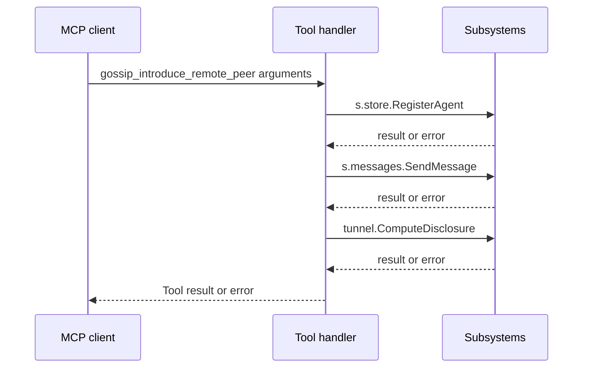
```mermaid
sequenceDiagram
    participant C as MCP client
    participant H as Tool handler
    participant S as Subsystems
    C->>H: gossip_introduce_remote_peer arguments
    H->>S: s.store.RegisterAgent
    S-->>H: result or error
    H->>S: s.messages.SendMessage
    S-->>H: result or error
    H->>S: tunnel.ComputeDisclosure
    S-->>H: result or error
    H-->>C: Tool result or error
```

### `gossip_status`

Aliases: `gsp_status`, `gossip_get_status`.

Get complete real-time status of the Gossip collaboration mesh: active agents, DAG tasks, strategic goals, knowledge graph metrics, and mandatory remote tunnel/peer disclosure.

[Registration and handler](../pkg/mcp/server.go#L767).

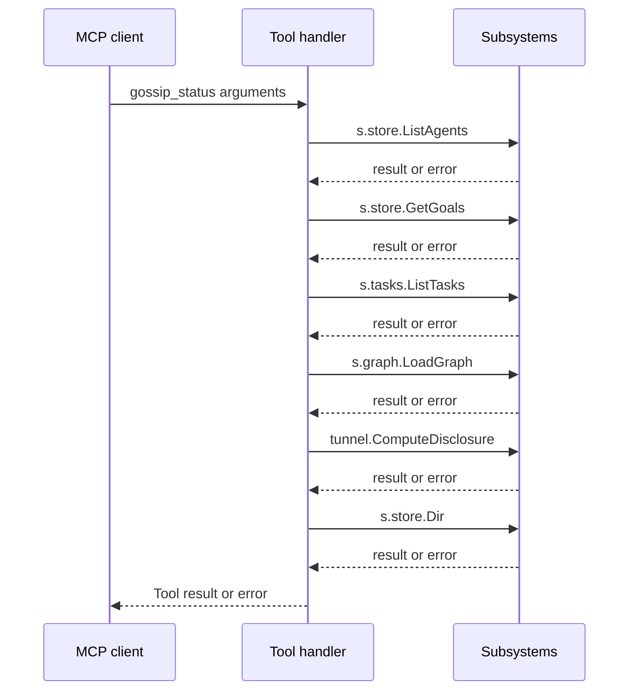
```mermaid
sequenceDiagram
    participant C as MCP client
    participant H as Tool handler
    participant S as Subsystems
    C->>H: gossip_status arguments
    H->>S: s.store.ListAgents
    S-->>H: result or error
    H->>S: s.store.GetGoals
    S-->>H: result or error
    H->>S: s.tasks.ListTasks
    S-->>H: result or error
    H->>S: s.graph.LoadGraph
    S-->>H: result or error
    H->>S: tunnel.ComputeDisclosure
    S-->>H: result or error
    H->>S: s.store.Dir
    S-->>H: result or error
    H-->>C: Tool result or error
```

### `gossip_setup_tunnel`

Aliases: `gsp_setup_tunnel`.

Deactivate legacy HTTP tunnel metadata. Activation and config generation are disabled; project access uses the coordination TLS endpoint over an FRP TCP proxy.

[Registration and handler](../pkg/mcp/server.go#L823).

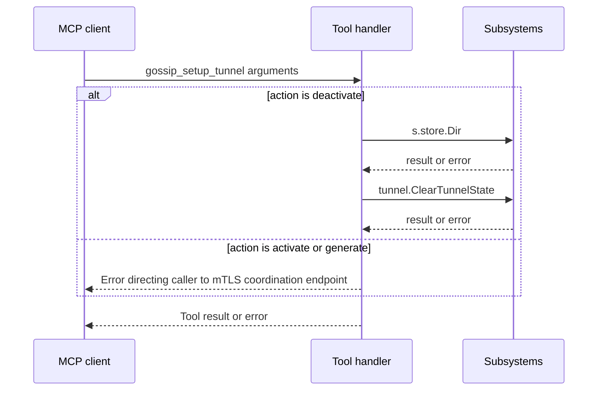
```mermaid
sequenceDiagram
    participant C as MCP client
    participant H as Tool handler
    participant S as Subsystems
    C->>H: gossip_setup_tunnel arguments
    alt action is deactivate
        H->>S: s.store.Dir
        S-->>H: result or error
        H->>S: tunnel.ClearTunnelState
        S-->>H: result or error
    else action is activate or generate
        H-->>C: Error directing caller to mTLS coordination endpoint
    end
    H-->>C: Tool result or error
```

### `gossip_setup_cron`

Aliases: `gsp_setup_cron`.

Configure periodic health check schedule and execute initial check cycle.

[Registration and handler](../pkg/mcp/server.go#L922).

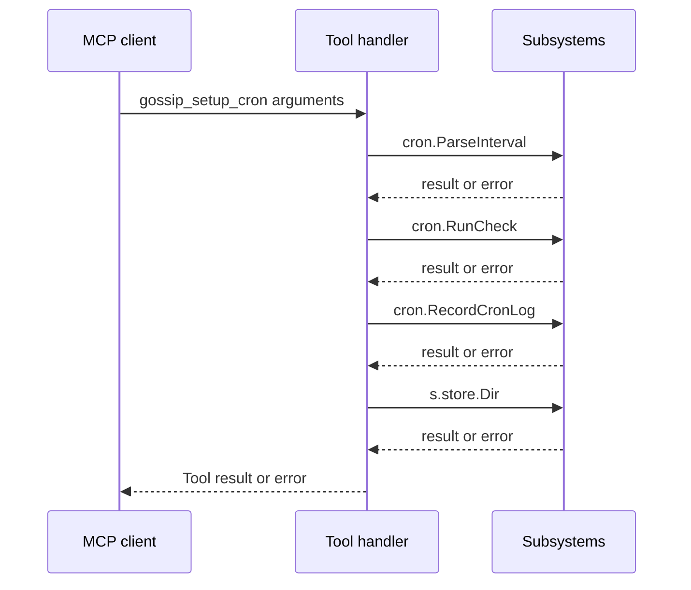
```mermaid
sequenceDiagram
    participant C as MCP client
    participant H as Tool handler
    participant S as Subsystems
    C->>H: gossip_setup_cron arguments
    H->>S: cron.ParseInterval
    S-->>H: result or error
    H->>S: cron.RunCheck
    S-->>H: result or error
    H->>S: cron.RecordCronLog
    S-->>H: result or error
    H->>S: s.store.Dir
    S-->>H: result or error
    H-->>C: Tool result or error
```

### `gossip_get_role_definition`

Retrieve system prompt, responsibilities, guidelines, and recommended tools for a specific role.

[Registration and handler](../pkg/mcp/server.go#L952).

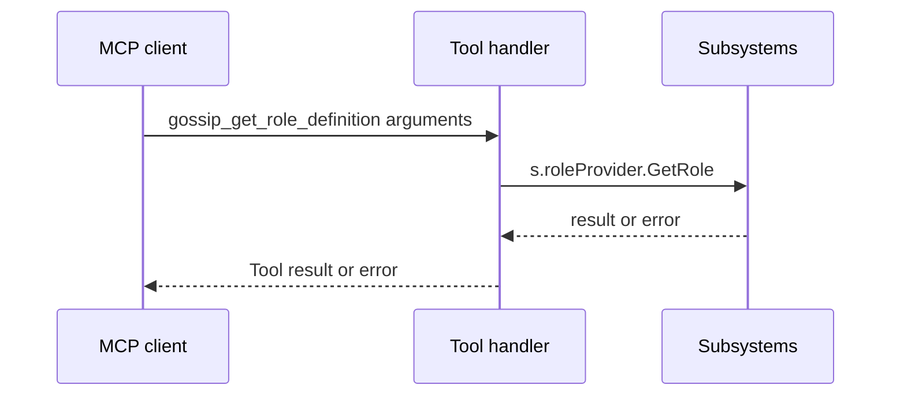
```mermaid
sequenceDiagram
    participant C as MCP client
    participant H as Tool handler
    participant S as Subsystems
    C->>H: gossip_get_role_definition arguments
    H->>S: s.roleProvider.GetRole
    S-->>H: result or error
    H-->>C: Tool result or error
```

### `gossip_list_roles`

List all available specialist roles loaded dynamically from JSON in Markdown.

[Registration and handler](../pkg/mcp/server.go#L965).

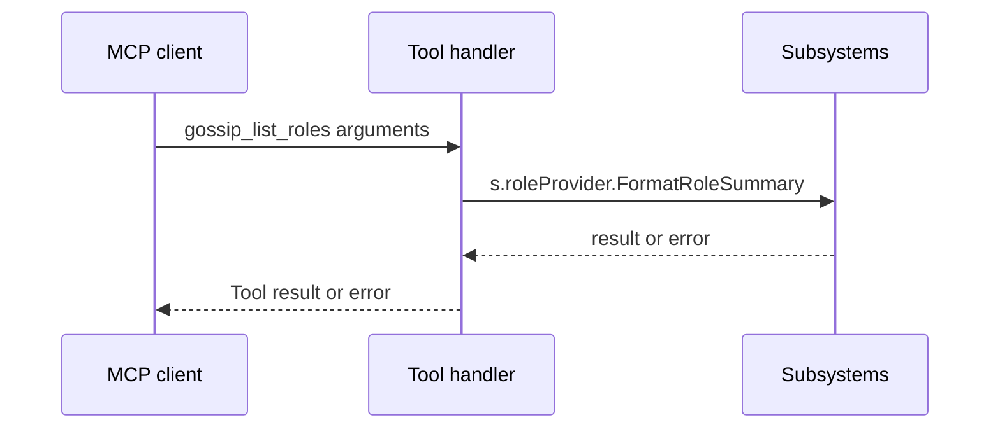
```mermaid
sequenceDiagram
    participant C as MCP client
    participant H as Tool handler
    participant S as Subsystems
    C->>H: gossip_list_roles arguments
    H->>S: s.roleProvider.FormatRoleSummary
    S-->>H: result or error
    H-->>C: Tool result or error
```

### `gossip_register_custom_role`

Dynamically define and register a new custom agent role at runtime (stored in JSON).

[Registration and handler](../pkg/mcp/server.go#L972).

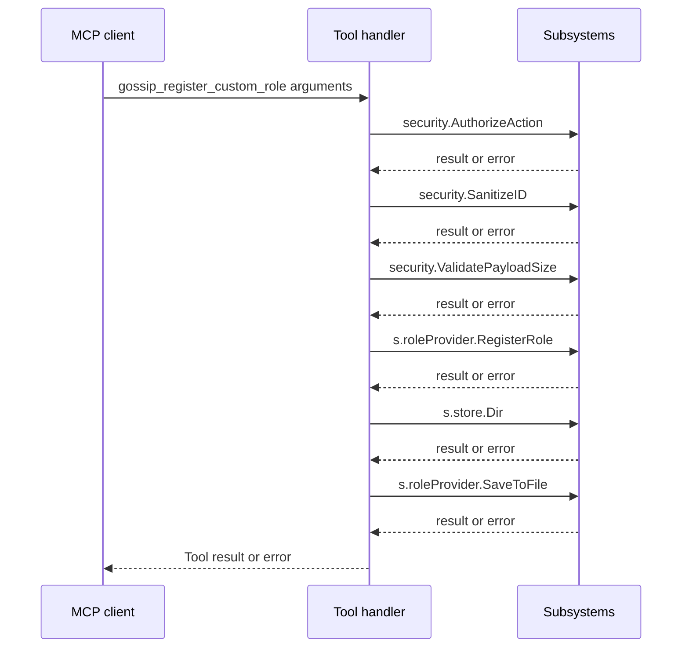
```mermaid
sequenceDiagram
    participant C as MCP client
    participant H as Tool handler
    participant S as Subsystems
    C->>H: gossip_register_custom_role arguments
    H->>S: security.AuthorizeAction
    S-->>H: result or error
    H->>S: security.SanitizeID
    S-->>H: result or error
    H->>S: security.ValidatePayloadSize
    S-->>H: result or error
    H->>S: s.roleProvider.RegisterRole
    S-->>H: result or error
    H->>S: s.store.Dir
    S-->>H: result or error
    H->>S: s.roleProvider.SaveToFile
    S-->>H: result or error
    H-->>C: Tool result or error
```

### `gossip_send_message`

Send a message to a specific agent, a role channel, or broadcast to all.

[Registration and handler](../pkg/mcp/server.go#L1045).

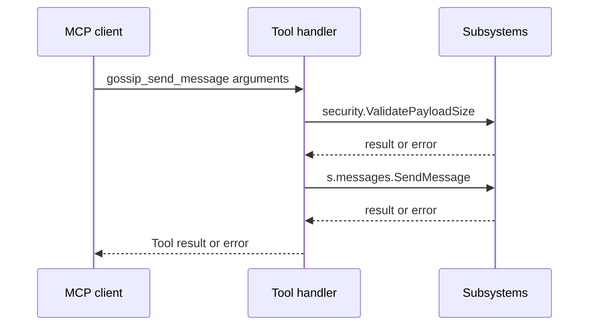
```mermaid
sequenceDiagram
    participant C as MCP client
    participant H as Tool handler
    participant S as Subsystems
    C->>H: gossip_send_message arguments
    H->>S: security.ValidatePayloadSize
    S-->>H: result or error
    H->>S: s.messages.SendMessage
    S-->>H: result or error
    H-->>C: Tool result or error
```

### `gossip_broadcast_message`

Broadcast a high-priority message or announcement to all active agents in the project.

[Registration and handler](../pkg/mcp/server.go#L1079).

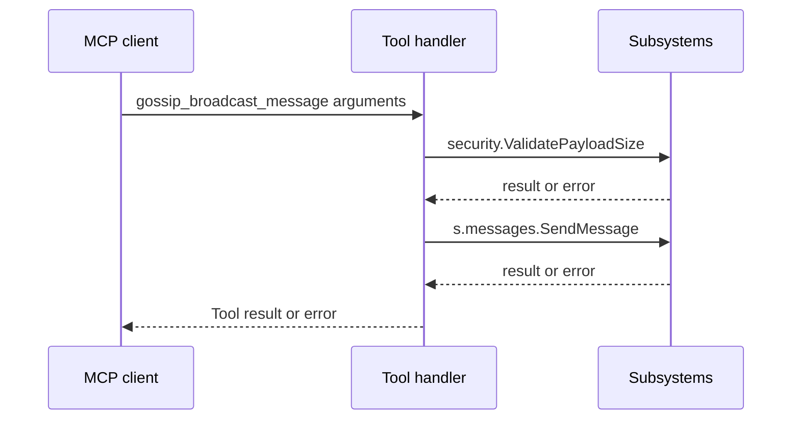
```mermaid
sequenceDiagram
    participant C as MCP client
    participant H as Tool handler
    participant S as Subsystems
    C->>H: gossip_broadcast_message arguments
    H->>S: security.ValidatePayloadSize
    S-->>H: result or error
    H->>S: s.messages.SendMessage
    S-->>H: result or error
    H-->>C: Tool result or error
```

### `gossip_read_inbox`

Read messages sent to this agent or this agent's role.

[Registration and handler](../pkg/mcp/server.go#L1109).

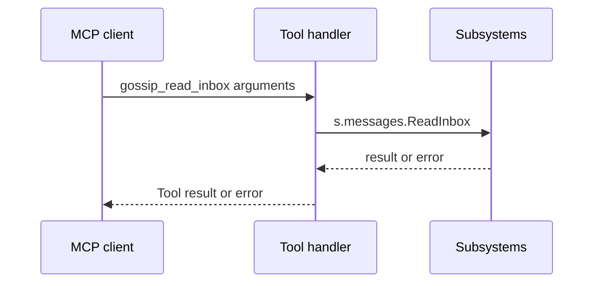
```mermaid
sequenceDiagram
    participant C as MCP client
    participant H as Tool handler
    participant S as Subsystems
    C->>H: gossip_read_inbox arguments
    H->>S: s.messages.ReadInbox
    S-->>H: result or error
    H-->>C: Tool result or error
```

### `gossip_mark_messages_read`

Mark messages as read for this agent.

[Registration and handler](../pkg/mcp/server.go#L1137).

```mermaid
sequenceDiagram
    participant C as MCP client
    participant H as Tool handler
    participant S as Subsystems
    C->>H: gossip_mark_messages_read arguments
    H->>S: s.messages.MarkRead
    S-->>H: result or error
    H-->>C: Tool result or error
```

### `gossip_list_threads`

List active discussion threads and participant summaries.

[Registration and handler](../pkg/mcp/server.go#L1158).

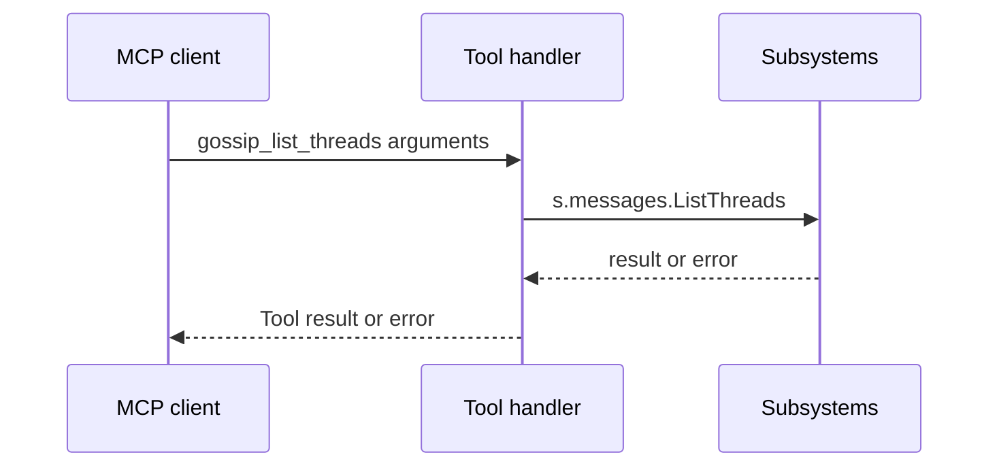
```mermaid
sequenceDiagram
    participant C as MCP client
    participant H as Tool handler
    participant S as Subsystems
    C->>H: gossip_list_threads arguments
    H->>S: s.messages.ListThreads
    S-->>H: result or error
    H-->>C: Tool result or error
```

### `gossip_set_goal`

Set or update high-level strategic goals and milestone checkpoints.

[Registration and handler](../pkg/mcp/server.go#L1175).

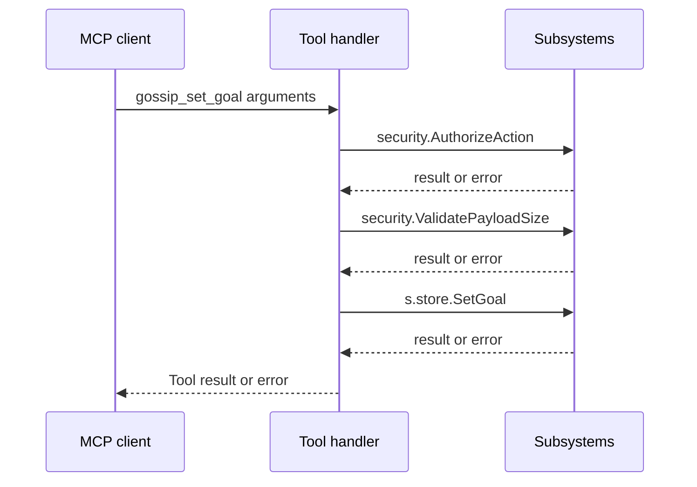
```mermaid
sequenceDiagram
    participant C as MCP client
    participant H as Tool handler
    participant S as Subsystems
    C->>H: gossip_set_goal arguments
    H->>S: security.AuthorizeAction
    S-->>H: result or error
    H->>S: security.ValidatePayloadSize
    S-->>H: result or error
    H->>S: s.store.SetGoal
    S-->>H: result or error
    H-->>C: Tool result or error
```

### `gossip_get_goals`

Get active project goals, milestones, and status.

[Registration and handler](../pkg/mcp/server.go#L1223).

```mermaid
sequenceDiagram
    participant C as MCP client
    participant H as Tool handler
    participant S as Subsystems
    C->>H: gossip_get_goals arguments
    H->>S: s.store.GetGoals
    S-->>H: result or error
    H-->>C: Tool result or error
```

### `gossip_create_task`

Create a new task in the shared DAG with role target, priority, dependencies, and acceptance criteria.

[Registration and handler](../pkg/mcp/server.go#L1234).

```mermaid
sequenceDiagram
    participant C as MCP client
    participant H as Tool handler
    participant S as Subsystems
    C->>H: gossip_create_task arguments
    H->>S: security.ValidatePayloadSize
    S-->>H: result or error
    H->>S: s.tasks.CreateTask
    S-->>H: result or error
    H-->>C: Tool result or error
```

### `gossip_update_task`

Update task status, assign an agent, append progress notes, or register result artifacts.

[Registration and handler](../pkg/mcp/server.go#L1268).

```mermaid
sequenceDiagram
    participant C as MCP client
    participant H as Tool handler
    participant S as Subsystems
    C->>H: gossip_update_task arguments
    H->>S: security.ValidatePayloadSize
    S-->>H: result or error
    H->>S: security.ValidateSafePath
    S-->>H: result or error
    H->>S: s.store.GetBaseDir
    S-->>H: result or error
    H->>S: s.tasks.UpdateTask
    S-->>H: result or error
    H-->>C: Tool result or error
```

### `gossip_list_tasks`

List tasks in the shared DAG with optional filtering by status, role, or assignee.

[Registration and handler](../pkg/mcp/server.go#L1308).

```mermaid
sequenceDiagram
    participant C as MCP client
    participant H as Tool handler
    participant S as Subsystems
    C->>H: gossip_list_tasks arguments
    H->>S: s.tasks.ListTasks
    S-->>H: result or error
    H-->>C: Tool result or error
```

### `gossip_get_task`

Retrieve full details, notes, blockers, and artifacts for a single task.

[Registration and handler](../pkg/mcp/server.go#L1328).

```mermaid
sequenceDiagram
    participant C as MCP client
    participant H as Tool handler
    participant S as Subsystems
    C->>H: gossip_get_task arguments
    H->>S: s.tasks.GetTask
    S-->>H: result or error
    H-->>C: Tool result or error
```

### `gossip_render_board`

Render and return the live Markdown Kanban board (BOARD.md) representing current multi-agent work state.

[Registration and handler](../pkg/mcp/server.go#L1341).

```mermaid
sequenceDiagram
    participant C as MCP client
    participant H as Tool handler
    participant S as Subsystems
    C->>H: gossip_render_board arguments
    H->>S: s.tasks.RenderBoard
    S-->>H: result or error
    H-->>C: Tool result or error
```

### `gossip_personal_todo_add`

Add a personal checklist item or scratchpad task for an agent to track internal sub-steps.

[Registration and handler](../pkg/mcp/server.go#L1352).

```mermaid
sequenceDiagram
    participant C as MCP client
    participant H as Tool handler
    participant S as Subsystems
    C->>H: gossip_personal_todo_add arguments
    H->>S: s.tasks.AddPersonalTodo
    S-->>H: result or error
    H-->>C: Tool result or error
```

### `gossip_personal_todo_list`

List an agent's personal to-do scratchpad items and working checklist.

[Registration and handler](../pkg/mcp/server.go#L1379).

```mermaid
sequenceDiagram
    participant C as MCP client
    participant H as Tool handler
    participant S as Subsystems
    C->>H: gossip_personal_todo_list arguments
    H->>S: s.tasks.ListPersonalTodos
    S-->>H: result or error
    H-->>C: Tool result or error
```

### `gossip_personal_todo_update`

Update status or notes for an agent's personal checklist item.

[Registration and handler](../pkg/mcp/server.go#L1400).

```mermaid
sequenceDiagram
    participant C as MCP client
    participant H as Tool handler
    participant S as Subsystems
    C->>H: gossip_personal_todo_update arguments
    H->>S: s.tasks.UpdatePersonalTodo
    S-->>H: result or error
    H-->>C: Tool result or error
```

### `gossip_personal_todo_delete`

Delete an item from an agent's personal checklist.

[Registration and handler](../pkg/mcp/server.go#L1425).

```mermaid
sequenceDiagram
    participant C as MCP client
    participant H as Tool handler
    participant S as Subsystems
    C->>H: gossip_personal_todo_delete arguments
    H->>S: s.tasks.DeletePersonalTodo
    S-->>H: result or error
    H-->>C: Tool result or error
```

### `gossip_system_todo_list`

Retrieve unified system-wide backlog aggregating unassigned ready DAG tasks, incomplete milestones, pending SOP phase gates, and open security vulnerabilities.

[Registration and handler](../pkg/mcp/server.go#L1445).

```mermaid
sequenceDiagram
    participant C as MCP client
    participant H as Tool handler
    participant S as Subsystems
    C->>H: gossip_system_todo_list arguments
    H->>S: s.tasks.GetSystemTodoList
    S-->>H: result or error
    H-->>C: Tool result or error
```

### `gossip_orchestrator_assignments`

Orchestrator central assignment matrix: active tasks per agent, workload distribution, bottleneck tasks, and idle-worker delegation suggestions.

[Registration and handler](../pkg/mcp/server.go#L1464).

```mermaid
sequenceDiagram
    participant C as MCP client
    participant H as Tool handler
    participant S as Subsystems
    C->>H: gossip_orchestrator_assignments arguments
    H->>S: s.tasks.GetOrchestratorAssignments
    S-->>H: result or error
    H-->>C: Tool result or error
```

### `gossip_rag_add_node`

Add a concept, file, code symbol, architectural decision, constraint, or formal proof to the shared knowledge graph.

[Registration and handler](../pkg/mcp/server.go#L1487).

```mermaid
sequenceDiagram
    participant C as MCP client
    participant H as Tool handler
    participant S as Subsystems
    C->>H: gossip_rag_add_node arguments
    H->>S: security.ValidatePayloadSize
    S-->>H: result or error
    H->>S: security.SanitizeID
    S-->>H: result or error
    H->>S: security.ValidateSafePath
    S-->>H: result or error
    H->>S: s.store.GetBaseDir
    S-->>H: result or error
    H->>S: s.graph.AddNode
    S-->>H: result or error
    H-->>C: Tool result or error
```

### `gossip_rag_add_edge`

Add a directed, typed relationship between two nodes in the shared knowledge graph with provenance tracking.

[Registration and handler](../pkg/mcp/server.go#L1545).

```mermaid
sequenceDiagram
    participant C as MCP client
    participant H as Tool handler
    participant S as Subsystems
    C->>H: gossip_rag_add_edge arguments
    H->>S: s.graph.AddEdge
    S-->>H: result or error
    H-->>C: Tool result or error
```

### `gossip_rag_query`

Search the shared knowledge graph using keywords, type filter, and tag filter with relevance ranking.

[Registration and handler](../pkg/mcp/server.go#L1584).

```mermaid
sequenceDiagram
    participant C as MCP client
    participant H as Tool handler
    participant S as Subsystems
    C->>H: gossip_rag_query arguments
    H->>S: s.graph.Query
    S-->>H: result or error
    H-->>C: Tool result or error
```

### `gossip_rag_get_neighborhood`

Extract connected subgraphs around a node within 1 to 3 hops to understand dependencies and impact.

[Registration and handler](../pkg/mcp/server.go#L1606).

```mermaid
sequenceDiagram
    participant C as MCP client
    participant H as Tool handler
    participant S as Subsystems
    C->>H: gossip_rag_get_neighborhood arguments
    H->>S: s.graph.GetNeighborhood
    S-->>H: result or error
    H-->>C: Tool result or error
```

### `gossip_rag_find_path`

Find the shortest relationship path between two concepts/nodes to trace transitive dependencies or conflicts.

[Registration and handler](../pkg/mcp/server.go#L1628).

```mermaid
sequenceDiagram
    participant C as MCP client
    participant H as Tool handler
    participant S as Subsystems
    C->>H: gossip_rag_find_path arguments
    H->>S: s.graph.FindPath
    S-->>H: result or error
    H-->>C: Tool result or error
```

### `gossip_rag_export_report`

Generate and return the comprehensive GRAPH_REPORT.md summarizing knowledge hubs, provenance, decisions, and proofs.

[Registration and handler](../pkg/mcp/server.go#L1657).

```mermaid
sequenceDiagram
    participant C as MCP client
    participant H as Tool handler
    participant S as Subsystems
    C->>H: gossip_rag_export_report arguments
    H->>S: s.graph.GenerateReport
    S-->>H: result or error
    H-->>C: Tool result or error
```

### `gossip_rag_pagerank`

Compute PageRank centrality scores across all knowledge nodes to identify architecturally critical components (inspired by Aider repo-map).

[Registration and handler](../pkg/mcp/server.go#L1668).

```mermaid
sequenceDiagram
    participant C as MCP client
    participant H as Tool handler
    participant S as Subsystems
    C->>H: gossip_rag_pagerank arguments
    H->>S: s.graph.ComputePageRank
    S-->>H: result or error
    H-->>C: Tool result or error
```

### `gossip_rag_impact_analysis`

Perform blast-radius impact analysis when modifying a node/symbol/file, discovering all direct and indirect dependents (inspired by Graphify affected.py).

[Registration and handler](../pkg/mcp/server.go#L1687).

```mermaid
sequenceDiagram
    participant C as MCP client
    participant H as Tool handler
    participant S as Subsystems
    C->>H: gossip_rag_impact_analysis arguments
    H->>S: s.graph.AffectedNodes
    S-->>H: result or error
    H-->>C: Tool result or error
```

### `gossip_rag_clusters`

Detect modular architectural clusters and submodules in the knowledge graph (inspired by Graphify cluster.py).

[Registration and handler](../pkg/mcp/server.go#L1708).

```mermaid
sequenceDiagram
    participant C as MCP client
    participant H as Tool handler
    participant S as Subsystems
    C->>H: gossip_rag_clusters arguments
    H->>S: s.graph.DetectClusters
    S-->>H: result or error
    H-->>C: Tool result or error
```

### `gossip_rag_repo_map`

Generate a compact, token-budgeted architectural map ranked by PageRank centrality (inspired by Aider repo-map).

[Registration and handler](../pkg/mcp/server.go#L1719).

```mermaid
sequenceDiagram
    participant C as MCP client
    participant H as Tool handler
    participant S as Subsystems
    C->>H: gossip_rag_repo_map arguments
    H->>S: s.graph.GenerateRepoMap
    S-->>H: result or error
    H-->>C: Tool result or error
```

### `gossip_rag_index_codebase`

Automatically index the codebase (files, packages, AST symbols, decisions, invariants) into the shared RAG knowledge graph.

[Registration and handler](../pkg/mcp/server.go#L1734).

```mermaid
sequenceDiagram
    participant C as MCP client
    participant H as Tool handler
    participant S as Subsystems
    C->>H: gossip_rag_index_codebase arguments
    H->>S: s.store.GetBaseDir
    S-->>H: result or error
    H->>S: s.graph.IndexCodebase
    S-->>H: result or error
    H-->>C: Tool result or error
```

### `gsp_index`

Alias for gossip_rag_index_codebase: parse AST and index codebase into RAG space.

[Registration and handler](../pkg/mcp/server.go#L1752).

```mermaid
sequenceDiagram
    participant C as MCP client
    participant H as Tool handler
    participant S as Subsystems
    C->>H: gsp_index arguments
    H->>S: s.store.GetBaseDir
    S-->>H: result or error
    H->>S: s.graph.IndexCodebase
    S-->>H: result or error
    H-->>C: Tool result or error
```

### `gossip_start_debate`

Open a multi-agent debate session on an architectural choice, controversial design, or proposal.

[Registration and handler](../pkg/mcp/server.go#L1775).

```mermaid
sequenceDiagram
    participant C as MCP client
    participant H as Tool handler
    participant S as Subsystems
    C->>H: gossip_start_debate arguments
    H->>S: s.deliberations.StartDebate
    S-->>H: result or error
    H-->>C: Tool result or error
```

### `gossip_post_argument`

Post an argument in an active multi-agent debate (pro, con, critique, rebuttal, or neutral).

[Registration and handler](../pkg/mcp/server.go#L1801).

```mermaid
sequenceDiagram
    participant C as MCP client
    participant H as Tool handler
    participant S as Subsystems
    C->>H: gossip_post_argument arguments
    H->>S: s.deliberations.PostArgument
    S-->>H: result or error
    H-->>C: Tool result or error
```

### `gossip_cast_vote`

Cast a formal vote on an active debate or proposal.

[Registration and handler](../pkg/mcp/server.go#L1829).

```mermaid
sequenceDiagram
    participant C as MCP client
    participant H as Tool handler
    participant S as Subsystems
    C->>H: gossip_cast_vote arguments
    H->>S: s.deliberations.CastVote
    S-->>H: result or error
    H-->>C: Tool result or error
```

### `gossip_conclude_debate`

Conclude a debate, tally votes, establish consensus, and record the final resolution.

[Registration and handler](../pkg/mcp/server.go#L1859).

```mermaid
sequenceDiagram
    participant C as MCP client
    participant H as Tool handler
    participant S as Subsystems
    C->>H: gossip_conclude_debate arguments
    H->>S: s.deliberations.ConcludeDebate
    S-->>H: result or error
    H->>S: s.graph.AddNode
    S-->>H: result or error
    H-->>C: Tool result or error
```

### `gossip_request_review`

Request a formal peer review or critique cycle on a task, artifact, or code file.

[Registration and handler](../pkg/mcp/server.go#L1897).

```mermaid
sequenceDiagram
    participant C as MCP client
    participant H as Tool handler
    participant S as Subsystems
    C->>H: gossip_request_review arguments
    H->>S: s.deliberations.RequestReview
    S-->>H: result or error
    H-->>C: Tool result or error
```

### `gossip_submit_review`

Submit structured review findings, critique, and formal verdict on a pending review.

[Registration and handler](../pkg/mcp/server.go#L1923).

```mermaid
sequenceDiagram
    participant C as MCP client
    participant H as Tool handler
    participant S as Subsystems
    C->>H: gossip_submit_review arguments
    H->>S: s.deliberations.SubmitReview
    S-->>H: result or error
    H-->>C: Tool result or error
```

### `gossip_log_red_team_probe`

Log an adversarial red-team penetration, fuzzing vector, concurrency race, or boundary exploit.

[Registration and handler](../pkg/mcp/server.go#L1949).

```mermaid
sequenceDiagram
    participant C as MCP client
    participant H as Tool handler
    participant S as Subsystems
    C->>H: gossip_log_red_team_probe arguments
    H->>S: s.deliberations.LogRedTeamProbe
    S-->>H: result or error
    H-->>C: Tool result or error
```

### `gossip_list_deliberations`

List debates, peer reviews, and red team probes with optional filtering.

[Registration and handler](../pkg/mcp/server.go#L1981).

```mermaid
sequenceDiagram
    participant C as MCP client
    participant H as Tool handler
    participant S as Subsystems
    C->>H: gossip_list_deliberations arguments
    H->>S: s.deliberations.ListDebates
    S-->>H: result or error
    H->>S: s.deliberations.ListReviews
    S-->>H: result or error
    H->>S: s.deliberations.ListProbes
    S-->>H: result or error
    H-->>C: Tool result or error
```

### `gossip_advance_debate_round`

Close the current round of an active debate and open the next round for critique and rebuttal.

[Registration and handler](../pkg/mcp/server.go#L2017).

```mermaid
sequenceDiagram
    participant C as MCP client
    participant H as Tool handler
    participant S as Subsystems
    C->>H: gossip_advance_debate_round arguments
    H->>S: s.deliberations.AdvanceRound
    S-->>H: result or error
    H-->>C: Tool result or error
```

### `gossip_debate_ranked_vote`

Cast a ranked-choice ballot ordering multiple alternative candidates (Borda Count tallying).

[Registration and handler](../pkg/mcp/server.go#L2034).

```mermaid
sequenceDiagram
    participant C as MCP client
    participant H as Tool handler
    participant S as Subsystems
    C->>H: gossip_debate_ranked_vote arguments
    H->>S: s.deliberations.CastRankedVote
    S-->>H: result or error
    H-->>C: Tool result or error
```

### `gossip_debate_tally_ranked_votes`

Tally ranked-choice votes using confidence-weighted Borda Count to identify the consensus winner.

[Registration and handler](../pkg/mcp/server.go#L2063).

```mermaid
sequenceDiagram
    participant C as MCP client
    participant H as Tool handler
    participant S as Subsystems
    C->>H: gossip_debate_tally_ranked_votes arguments
    H->>S: s.deliberations.TallyRankedVotes
    S-->>H: result or error
    H-->>C: Tool result or error
```

### `gossip_debate_check_convergence`

Evaluate whether a multi-round debate has converged towards consensus or if further rounds are needed.

[Registration and handler](../pkg/mcp/server.go#L2081).

```mermaid
sequenceDiagram
    participant C as MCP client
    participant H as Tool handler
    participant S as Subsystems
    C->>H: gossip_debate_check_convergence arguments
    H->>S: s.deliberations.CheckConvergence
    S-->>H: result or error
    H-->>C: Tool result or error
```

### `gossip_redteam_generate_stride_probes`

Generate structured adversarial STRIDE threat probes (Spoofing, Tampering, Repudiation, Info Disclosure, DoS, Elevation of Privilege).

[Registration and handler](../pkg/mcp/server.go#L2099).

```mermaid
sequenceDiagram
    participant C as MCP client
    participant H as Tool handler
    participant S as Subsystems
    C->>H: gossip_redteam_generate_stride_probes arguments
    H->>S: s.deliberations.LogBatchProbes
    S-->>H: result or error
    H-->>C: Tool result or error
```

### `gossip_redteam_generate_audit_report`

Generate and save the executive AUDIT_REPORT.md summarizing all red-team security evaluations.

[Registration and handler](../pkg/mcp/server.go#L2128).

```mermaid
sequenceDiagram
    participant C as MCP client
    participant H as Tool handler
    participant S as Subsystems
    C->>H: gossip_redteam_generate_audit_report arguments
    H->>S: s.deliberations.GenerateAuditReport
    S-->>H: result or error
    H-->>C: Tool result or error
```

### `gossip_sop_list_workflows`

List active Standard Operating Procedure (SOP) workflows and available templates (MetaGPT-inspired).

[Registration and handler](../pkg/mcp/server.go#L2143).

```mermaid
sequenceDiagram
    participant C as MCP client
    participant H as Tool handler
    participant S as Subsystems
    C->>H: gossip_sop_list_workflows arguments
    H->>S: s.sop.ListWorkflows
    S-->>H: result or error
    H-->>C: Tool result or error
```

### `gossip_sop_start`

Start a structured SOP workflow (templates: 'feature_delivery', 'bug_investigation', 'security_hardening').

[Registration and handler](../pkg/mcp/server.go#L2165).

```mermaid
sequenceDiagram
    participant C as MCP client
    participant H as Tool handler
    participant S as Subsystems
    C->>H: gossip_sop_start arguments
    H->>S: s.sop.StartWorkflow
    S-->>H: result or error
    H-->>C: Tool result or error
```

### `gossip_sop_save_artifact`

Save a versioned SOP artifact deliverable (PRD, System Design, Task Plan, Review, Security Audit).

[Registration and handler](../pkg/mcp/server.go#L2190).

```mermaid
sequenceDiagram
    participant C as MCP client
    participant H as Tool handler
    participant S as Subsystems
    C->>H: gossip_sop_save_artifact arguments
    H->>S: s.sop.SaveArtifact
    S-->>H: result or error
    H-->>C: Tool result or error
```

### `gossip_sop_advance`

Advance an SOP workflow to the next phase gate, verifying that required deliverables and roles match.

[Registration and handler](../pkg/mcp/server.go#L2219).

```mermaid
sequenceDiagram
    participant C as MCP client
    participant H as Tool handler
    participant S as Subsystems
    C->>H: gossip_sop_advance arguments
    H->>S: s.sop.AdvanceStage
    S-->>H: result or error
    H-->>C: Tool result or error
```

### `gossip_sop_get_status`

Inspect the current stage, completed gates, and deliverables for an SOP workflow.

[Registration and handler](../pkg/mcp/server.go#L2242).

```mermaid
sequenceDiagram
    participant C as MCP client
    participant H as Tool handler
    participant S as Subsystems
    C->>H: gossip_sop_get_status arguments
    H->>S: s.sop.GetWorkflow
    S-->>H: result or error
    H-->>C: Tool result or error
```

### `gossip_derive_project_roles`

Synthesize LLM-derived specialist roles, guardrails, cautions, and AGENTS.md customized for this project.

[Registration and handler](../pkg/mcp/server.go#L2294).

```mermaid
sequenceDiagram
    participant C as MCP client
    participant H as Tool handler
    participant S as Subsystems
    C->>H: gossip_derive_project_roles arguments
    H->>S: s.guardrails.DeriveProjectRoles
    S-->>H: result or error
    H->>S: s.roleProvider.RegisterRole
    S-->>H: result or error
    H-->>C: Tool result or error
```

### `gsp_derive_roles`

Alias for gossip_derive_project_roles: derive roles, guardrails, cautions, and AGENTS.md.

[Registration and handler](../pkg/mcp/server.go#L2301).

```mermaid
sequenceDiagram
    participant C as MCP client
    participant H as Tool handler
    participant S as Subsystems
    C->>H: gsp_derive_roles arguments
    H->>S: s.guardrails.DeriveProjectRoles
    S-->>H: result or error
    H->>S: s.roleProvider.RegisterRole
    S-->>H: result or error
    H-->>C: Tool result or error
```

### `gossip_guardrails_validate_action`

Pre-flight inspection checking whether an action or file modification violates project cautions or forbidden rules.

[Registration and handler](../pkg/mcp/server.go#L2327).

```mermaid
sequenceDiagram
    participant C as MCP client
    participant H as Tool handler
    participant S as Subsystems
    C->>H: gossip_guardrails_validate_action arguments
    H->>S: s.guardrails.ValidateProposedAction
    S-->>H: result or error
    H-->>C: Tool result or error
```

### `gsp_guardrail_check`

Alias for gossip_guardrails_validate_action: pre-flight check against active cautions.

[Registration and handler](../pkg/mcp/server.go#L2335).

```mermaid
sequenceDiagram
    participant C as MCP client
    participant H as Tool handler
    participant S as Subsystems
    C->>H: gsp_guardrail_check arguments
    H->>S: s.guardrails.ValidateProposedAction
    S-->>H: result or error
    H-->>C: Tool result or error
```

### `gossip_set_caution_rule`

Add or update a safety caution rule, sensitive path pattern, or invariant in the project guardrail database.

[Registration and handler](../pkg/mcp/server.go#L2344).

```mermaid
sequenceDiagram
    participant C as MCP client
    participant H as Tool handler
    participant S as Subsystems
    C->>H: gossip_set_caution_rule arguments
    H->>S: s.guardrails.SetCautionRule
    S-->>H: result or error
    H-->>C: Tool result or error
```

### `gossip_get_guardrails`

Retrieve all project guardrails, active roles, forbidden actions, cautions, and invariants.

[Registration and handler](../pkg/mcp/server.go#L2375).

```mermaid
sequenceDiagram
    participant C as MCP client
    participant H as Tool handler
    participant S as Subsystems
    C->>H: gossip_get_guardrails arguments
    H->>S: s.guardrails.Load
    S-->>H: result or error
    H-->>C: Tool result or error
```

### `gossip_export_agents_md`

Re-render and write AGENTS.md and RULES.md in the project directory.

[Registration and handler](../pkg/mcp/server.go#L2386).

```mermaid
sequenceDiagram
    participant C as MCP client
    participant H as Tool handler
    participant S as Subsystems
    C->>H: gossip_export_agents_md arguments
    H->>S: s.guardrails.Load
    S-->>H: result or error
    H->>S: s.guardrails.Save
    S-->>H: result or error
    H->>S: s.guardrails.RenderAgentsMD
    S-->>H: result or error
    H-->>C: Tool result or error
```

### `gossip_poll_events`

Continuously poll or long-poll for updates, new messages, newly unblocked ready tasks, debate rounds, and peer activity with timeout.

[Registration and handler](../pkg/mcp/server.go#L2653).

```mermaid
sequenceDiagram
    participant C as MCP client
    participant H as Tool handler
    participant S as Subsystems
    C->>H: gossip_poll_events arguments
    H->>S: s.events.Poll
    S-->>H: result or error
    H-->>C: Tool result or error
```

### `gsp_poll`

Alias for gossip_poll_events: time-based continuous event polling and long-polling sync.

[Registration and handler](../pkg/mcp/server.go#L2665).

```mermaid
sequenceDiagram
    participant C as MCP client
    participant H as Tool handler
    participant S as Subsystems
    C->>H: gsp_poll arguments
    H->>S: s.events.Poll
    S-->>H: result or error
    H-->>C: Tool result or error
```

### `gossip_sync`

Alias for gossip_poll_events: synchronize state, heartbeat, and fetch new events.

[Registration and handler](../pkg/mcp/server.go#L2677).

```mermaid
sequenceDiagram
    participant C as MCP client
    participant H as Tool handler
    participant S as Subsystems
    C->>H: gossip_sync arguments
    H->>S: s.events.Poll
    S-->>H: result or error
    H-->>C: Tool result or error
```

### `gossip_log_event`

Append an explicit custom event or checkpoint to the shared event ledger (events.jsonl).

[Registration and handler](../pkg/mcp/server.go#L2686).

```mermaid
sequenceDiagram
    participant C as MCP client
    participant H as Tool handler
    participant S as Subsystems
    C->>H: gossip_log_event arguments
    H->>S: security.ValidatePayloadSize
    S-->>H: result or error
    H->>S: s.events.LogEvent
    S-->>H: result or error
    H-->>C: Tool result or error
```

### `gossip_moe_convene_panel`

Aliases: `gsp_moe_convene`.

Convene a dynamic Mixture of Experts (MoE) discussion council with automated router gating and specialist expert summoning.

[Registration and handler](../pkg/mcp/server.go#L2736).

```mermaid
sequenceDiagram
    participant C as MCP client
    participant H as Tool handler
    participant S as Subsystems
    C->>H: gossip_moe_convene_panel arguments
    H->>S: s.moe.ConvenePanel
    S-->>H: result or error
    H-->>C: Tool result or error
```

### `gossip_moe_post_argument`

Aliases: `gsp_moe_argument`.

Post a specialist expert domain perspective and technical argument to an active MoE panel.

[Registration and handler](../pkg/mcp/server.go#L2774).

```mermaid
sequenceDiagram
    participant C as MCP client
    participant H as Tool handler
    participant S as Subsystems
    C->>H: gossip_moe_post_argument arguments
    H->>S: s.moe.PostArgument
    S-->>H: result or error
    H-->>C: Tool result or error
```

### `gossip_moe_synthesize`

Aliases: `gsp_moe_synthesize`.

Synthesize the MoE council deliberations into a unified consensus decision and parallel subagent work packages.

[Registration and handler](../pkg/mcp/server.go#L2809).

```mermaid
sequenceDiagram
    participant C as MCP client
    participant H as Tool handler
    participant S as Subsystems
    C->>H: gossip_moe_synthesize arguments
    H->>S: s.moe.Synthesize
    S-->>H: result or error
    H-->>C: Tool result or error
```

### `gossip_moe_dispatch_subagents`

Aliases: `gsp_parallel`.

Dispatch parallel subagent tracks to execute decoupled DAG tasks concurrently.

[Registration and handler](../pkg/mcp/server.go#L2853).

```mermaid
sequenceDiagram
    participant C as MCP client
    participant H as Tool handler
    participant S as Subsystems
    C->>H: gossip_moe_dispatch_subagents arguments
    H->>S: s.moe.DispatchSubagents
    S-->>H: result or error
    H-->>C: Tool result or error
```

### `gossip_moe_list_panels`

Aliases: `gsp_moe_list`.

List all active and past Mixture of Experts panels and their subagent tracks.

[Registration and handler](../pkg/mcp/server.go#L2886).

```mermaid
sequenceDiagram
    participant C as MCP client
    participant H as Tool handler
    participant S as Subsystems
    C->>H: gossip_moe_list_panels arguments
    H->>S: s.moe.ListPanels
    S-->>H: result or error
    H-->>C: Tool result or error
```

### `gossip_cron_check`

Aliases: `gsp_cron_check`.

Execute periodic health check (unread messages, ready DAG tasks, stale heartbeats, tunnel disclosure) for agents supporting cron/scheduled monitoring.

[Registration and handler](../pkg/mcp/server.go#L2905).

```mermaid
sequenceDiagram
    participant C as MCP client
    participant H as Tool handler
    participant S as Subsystems
    C->>H: gossip_cron_check arguments
    H->>S: cron.RunCheck
    S-->>H: result or error
    H->>S: cron.RecordCronLog
    S-->>H: result or error
    H->>S: s.store.Dir
    S-->>H: result or error
    H-->>C: Tool result or error
```

### `gossip_secret_transfer`

Aliases: `gsp_vault_transfer`.

Securely stage or transfer sensitive secret files (e.g. .env, tokens, keys) across mesh nodes without exposing raw secret contents to agent context or LLM prompt history.

[Registration and handler](../pkg/mcp/server.go#L2925).

```mermaid
sequenceDiagram
    participant C as MCP client
    participant H as Tool handler
    participant S as Subsystems
    C->>H: gossip_secret_transfer arguments
    H->>S: s.vault.StageSecretFile
    S-->>H: result or error
    H->>S: s.vault.TransferSecretToRemote
    S-->>H: result or error
    H-->>C: Tool result or error
```

### `gossip_remote_query`

Aliases: `gsp_remote_query`.

Query a remote Gossip mesh node across the FRP tunnel or LAN when worktrees differ (e.g. separate repos or branches), querying remote graph, tasks, repomap, or status.

[Registration and handler](../pkg/mcp/server.go#L2969).

```mermaid
sequenceDiagram
    participant C as MCP client
    participant H as Tool handler
    participant S as Subsystems
    C->>H: gossip_remote_query arguments
    H->>S: tunnel.QueryRemoteNode
    S-->>H: result or error
    H-->>C: Tool result or error
```

## Other interfaces and scope

The dashboard exposes HTTP routes listed in `pkg/web/server.go:Handler`, including project selection, tasks, artifacts, messaging, MoE, tunnel, federation and vault. They are separate from MCP tool calls and are wrapped by the optional Basic Auth middleware. The CLI also exposes commands in `cmd/gossip/main.go` and `cmd/gossip/cli_ext.go`. Their argument parsing and side effects can differ from the MCP handlers. The per-operation diagrams above cover all MCP tool registrations, not every dashboard endpoint or CLI command.

```mermaid
sequenceDiagram
    participant Browser as HTTP client
    participant Auth as Optional Basic Auth
    participant Route as Dashboard route
    participant Manager as Manager or filesystem
    Browser->>Auth: HTTP request
    alt Authentication enabled and credentials invalid
        Auth-->>Browser: 401
    else Allowed
        Auth->>Route: Dispatch by path
        Route->>Manager: Route-specific operation
        Manager-->>Route: Data or error
        Route-->>Browser: HTTP response
    end
```

For the precise exposed schema and implementation, consult `pkg/mcp/server.go`, the respective package under `pkg/`, and the tests beside it. This document is an implementation reading, not evidence of penetration testing, load testing, or full verification of all failure paths.
